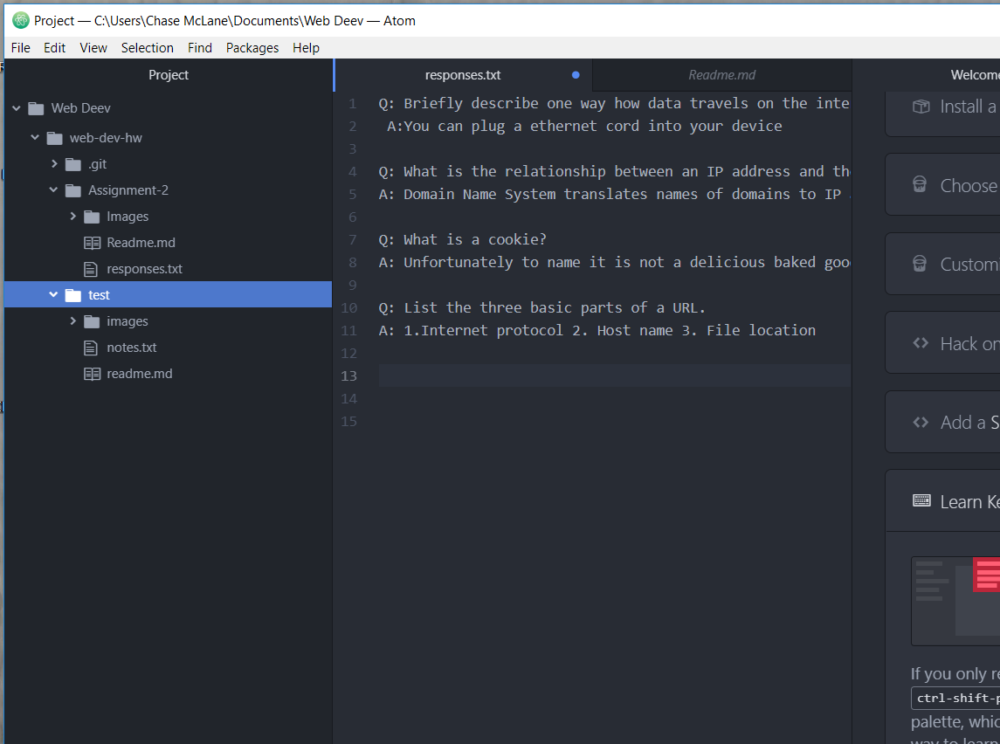

## Assignment part 2 technical report aka part 3

**Manages changes to docs, websites and information; This helps us stay organized overall and manage our files.**

**D. I do not understand what a work cycle is. I'm assuming it means my steps I took in which I did this assignment or simply how do you embed things with relative URLs.**

**Urls are very odd when you have NO guide to go off of, perhaps the phrasing just confused me.
regaurdless you**

- Square bracket what you want to say.

- parenthesis the location link right next to the ending square parenthesis.

[Responses](./responses.txt)

