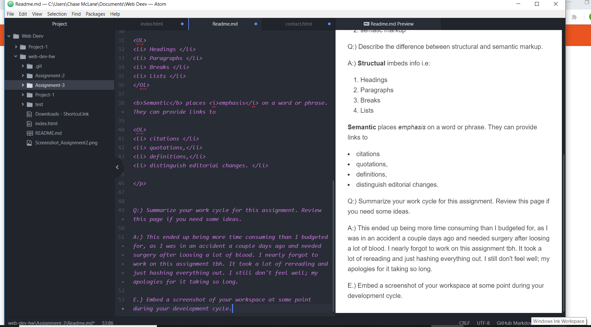

<!DOCTYPE html>
<html>
<head>
<body>
<H1> A3 Part 2
</h1>

Q:) How many main <head> and <body> elements can a page have? How are these elements different, or what role do they play?

A:)<h5> Head </h5>
<a href="https://media-ed-online.github.io/intro-web-dev/topic-04/head-elements/contains" target="_blank">high-level info about the site, and always comes first within the root</a>

<ul>
<li> Meta </li>
<li> Viewpoint </li>
<li> Title </li>
<li> Link </li>
<li> Style </li>
</ul>

<h5> Body </h5>
<ol>
<li> structural markup </li>
<li> sematic markup </li>
</ol>

Q:) Describe the difference between structural and semantic markup.

A:) <b>Structual</b> imbeds info i.e:

<Ol>
<li> Headings </li>
<li> Paragraphs </li>
<li> Breaks </li>
<li> Lists </li>
</Ol>

<b>Semantic</b> places <i>emphasis</i> on a word or phrase. They can provide links to

<Ol>
<li> citations </li>
<li> quotations,</li>
<li> definitions,</li>
<li> distinguish editorial changes. </li>

Q:) Summarize your work cycle for this assignment. Review this page if you need some ideas.

A:) This ended up being more time consuming than I budgeted for, as I was in an accident a couple days ago on Wednesday (10/10) and needed surgery after loosing a lot of blood. I nearly forgot to work on this assignment tbh. It took a lot of rereading and just hashing everything out. I still don't feel well; my apologies for it taking so long.

E.) Embed a screenshot of your workspace at some point during your development cycle.

 

</head>
</body>
</html>
