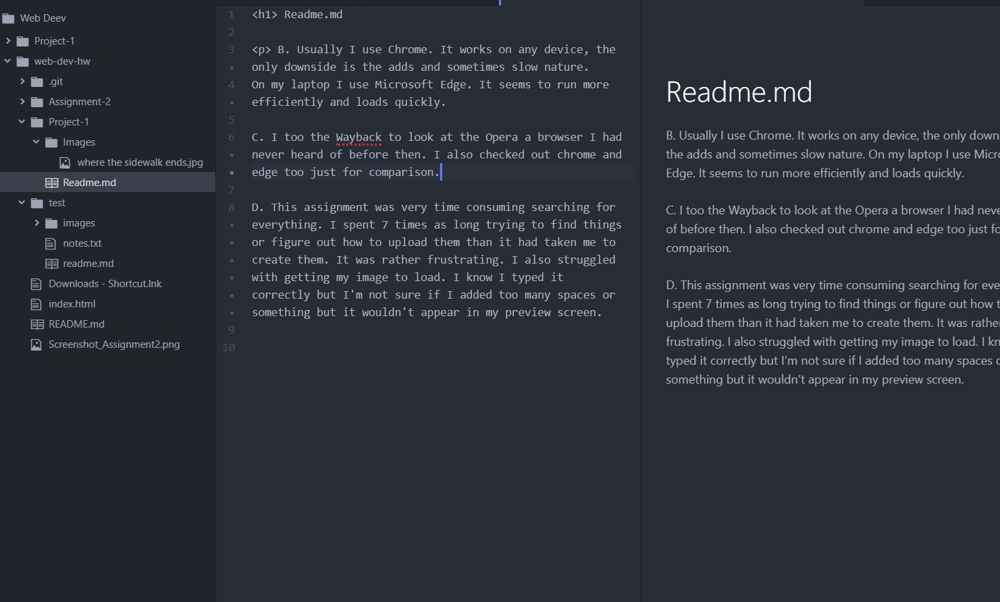

# Readme.md

B. Usually I use Chrome. It works on any device, the only downside is the adds and sometimes slow nature.
On my laptop I use Microsoft Edge. It seems to run more efficiently and loads quickly.

C. I too the Wayback to look at the Opera a browser I had never heard of before then. I also checked out chrome and edge too just for comparison.

D. This assignment was very time consuming searching for everything. I spent 7 times as long trying to find things or figure out how to upload them than it had taken me to create them. It was rather frustrating. I also struggled with getting my image to load. I know I typed it correctly but I'm not sure if I added too many spaces or something but it wouldn't appear in my preview screen.

